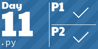
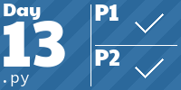
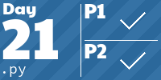
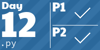

<!-- AOC TILES BEGIN -->
<h1 align="center">
  Advent of Code - 231/506 ⭐
</h1>
<h1 align="center">
  2023 - 50 ⭐ - Python
</h1>

<h1 align="center">
  2022 - 31 ⭐ - Python
</h1>

<h1 align="center">
  2017 - 50 ⭐ - Python
</h1>

<h1 align="center">
  2016 - 50 ⭐ - Python
</h1>

<h1 align="center">
  2015 - 50 ⭐ - Python
</h1>

<!-- AOC TILES END -->